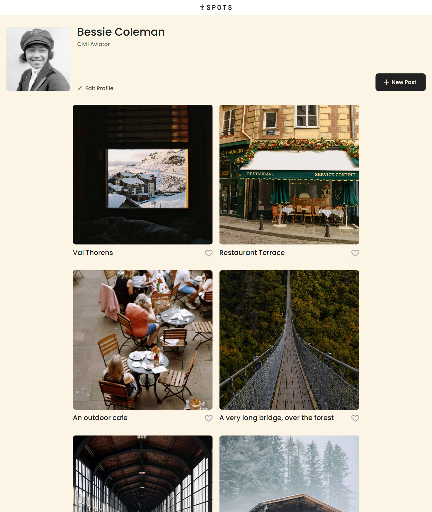
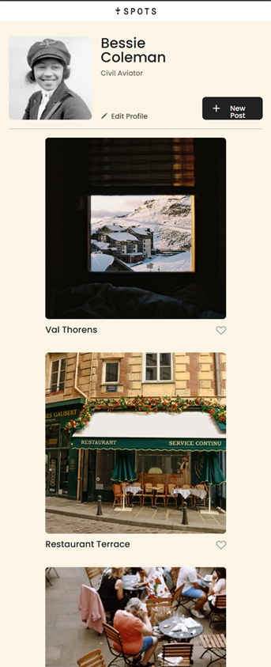

# Project 3: Spots

### Overview

- Intro
- Figma
- Images

**Intro**

Spots is a social media website that allows users to post pictures and share it with their friends. This is still a mock up of the website and does not have any active links.

[Link to webpage](https://mestabarbara.github.io/se_project_spots/index.html)

**Project Pitch Videos**

Check out the videos below where I describe this project and some of the challenges I faced:

-[Latest updates and challenges](https://drive.google.com/file/d/1yM16o2WWMlhIGa9w8yN0OF98zpoeJvG2/view?usp=sharing)

-[Previous Spot Overview](https://drive.google.com/file/d/1u1kEtsxsSMpVN9-yrKzf0oP2mTzYcQnM/view?usp=sharing)

**Figma**

- [Link to the project on Figma](https://www.figma.com/file/BBNm2bC3lj8QQMHlnqRsga/Sprint-3-Project-%E2%80%94-Spots?type=design&node-id=2%3A60&mode=design&t=afgNFybdorZO6cQo-1)

**Images**

The website supports websites from 320px and larger.

